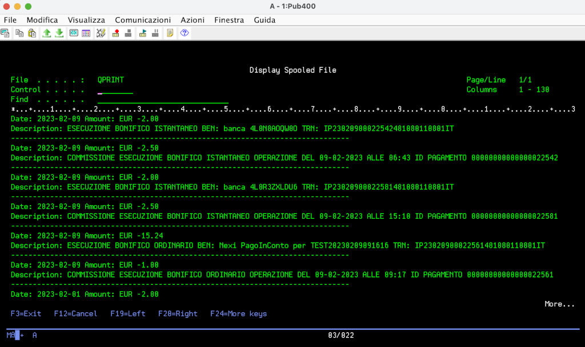

# Come usare API esterne su IBM i: l'esempio Open Banking
La piattaforma IBM i, essendo un server aziendale robusto e versatile, può con facilità collegarsi al mondo delle API REST, 
arricchendo gli applicativi che ospita di funzionalità prese dal cloud.
Nell'esempio di oggi vedremo come leggere i dati dei conti correnti bancari, che la normativa europea PDS2 ha reso fruibili 
anche da terze parti, software gestionali inclusi.
Per fare ciò ci serviremo dei seguenti strumenti:
* Le funzioni SQL [HttpPostClob](https://www.ibm.com/docs/en/i/7.3?topic=overview-httppostblob-httppostclob-scalar-functions) 
e [HttpGetCLob](https://www.ibm.com/docs/en/i/7.3?topic=overview-httpgetblob-httpgetclob-scalar-functions), che consentono di 
effettuare delle chiamate HTTP POST e GET tramite normali statement SQL. (Roberto De Pedrini ne ha parlato [qui](https://blog.faq400.com/it/database-db2-for-i/qsys2-http-functions-it/)).
* La funzione SQL [Json_Table](https://www.ibm.com/docs/en/i/7.3?topic=data-using-json-table) che converte un documento JSON in una tabella di DB2 for i.
* Ovviamente il linguaggio RPG ILE nel moderno formato free.
    
## Ottenere un token JWT con una POST
Le API REST sono, per definizione, stateless, cioè lo stato della comunicazione tra client e server non viene memorizzato sul server tra le varie richieste.
Ogni richiesta appare quindi "nuova" al server e deve pertanto contenere le informazioni necessarie all'autenticazione del client. 
Una delle tecniche spesso utilizzate a questo scopo consiste nell'inviare la coppia utente/password in una prima chiamata di autenticazione, 
che restituisce un token firmato dal server (JSON Web Token o [JWT](https://jwt.io/introduction)) con scadenza temporale, nel quale si certifica l'identità del proprietario. 
Il token viene quindi trasmesso in tutte le chiamate successive (fino alla sua scadenza) senza la necessità di presentare nuovamente le credenziali.
Anche il servizio di [A-CUBE per l'interazione con i conti correnti](https://docs.acubeapi.com/documentation/open-banking), 
per il quale è possibile richiedere delle credenziali di prova, prevede l'[autenticazione tramite JWT](https://docs.acubeapi.com/documentation/common/authentication/).
Vediamo il [programma d'esempio che effettua la connessione](getjwt.rpgle). 

A fronte di questa risposta JSON restituita dalla POST di login: 
```json
{ "token": "a very long encrypted token" }
```
definiamo una DS utile a estrarne il campo `token`
```rpgle
dcl-ds jsonData   qualified;
  token      varchar(2048);
end-ds;
```

Componiamo quindi le variabili che ci saranno utili per effettuare la chiamata, prendendo utente e password da variabili d'ambiente:
```rpgle
WebServiceUrl = 'https://common-sandbox.api.acubeapi.com/' +
                  'login';

WebServiceHeader = '<httpHeader>-
                       <header name="content-type" value="application/json" />-
                     </httpHeader>';

Email = %str(getenv('ACUBE_EMAIL'));
Password = %str(getenv('ACUBE_PASSWORD'));

WebServiceBody   = '{"email": "' + Email + '", "password": "' + Password + '"}';
```
Veniamo ora alla parte più importante. Grazie all'aiuto del linguaggio SQL incapsulato nel nostro programma RPG, possiamo:
1. effettuare una HTTPPOST verso il servizio con la funzione `Systools.HttpPostClob`
```rpgle
Systools.HttpPostClob(:WebServiceUrl, :WebServiceHeader, :WebServiceBody)
``` 
2. trasformare la risposta JSON in una tabella relazionale con la funzione `Json_Table`:
```rpgle
Select * from
   Json_Table(Systools.HttpPostClob(:WebServiceUrl, :WebServiceHeader, :WebServiceBody),
    '$'
    Columns(Token VarChar(2048)  Path '$.token'));
``` 
Le espressioni con il `$` rappresentano il percorso nella struttura JSON da cui partire per estrarre i dati: 
`$` è il punto corrente, `$.nomeCampo` il campo `nomeCampo` contenuto nell'oggetto corrente. [Qui](https://jsonpath.com/) potete fare qualche prova con
questi che sono detti `JSONPath`.
3. Leggere il contenuto della tabella così ottenuta e porlo nella DS.
```rpgle
Exec Sql
     Fetch Next From Csr01 into :jsonData
``` 
4. Mettere il token in una variabile d'ambiente per renderlo disponibile ai programmi chiamati successivamente.
```rpgle
putenv('ACUBE_TOKEN=' + jsonData.token);
``` 

## Censire il proprietario di un conto (Business Registry)
Il [programma d'esempio](createbr.rpgle) che censisce un nuovo proprietario di un conto (un Business Registry) ci offre la possibilità di utilizzare un'altra interessante funzione SQL.

L'API REST per la creazione di un Business Registry richiede di effettuare una POST con un payload JSON più grande del precedente. 
Per gestirlo facilmente possiamo scriverlo nell'IFS in uno stream file simile a [questo](br.json), 
per poi leggerlo da SQL con la funzione [IFS_READ](https://www.ibm.com/docs/en/i/7.3?topic=is-ifs-read-ifs-read-binary-ifs-read-utf8-table-functions).
Questa funzione richiede come parametri il percorso del file (nel nostro caso preso da una variabile d'ambiente), la dimensione massima delle righe 
e il delimitatore di riga. Nell'esempio indichiamo `NONE` come delimitatore perché desideriamo leggere tutto il file come un'unica riga.
Il contenuto del file così ottenuto è poi inserito in una variabile che sarà il body della nostra POST verso l'API.
```rpgle
JsonInputFile = %str(getenv('ACUBE_IFS_JSON'));

Exec SQL
Declare File Cursor For
    SELECT CAST(LINE AS CHAR(2048))
    From Table(IFS_READ(:JsonInputFile, 2048, 'NONE' )) As IFS;
Exec SQL Open File;

Exec SQL Fetch Next From File Into :WebServiceBody;    
```
Un'altra parte interessante è la composizione dell'header che comprende il token JWT posto in una variabile d'ambiente dal programma precedente.
```rpgle
Token = %str(getenv('ACUBE_TOKEN'));

WebServiceHeader = '<httpHeader> ' +
'  <header name="authorization" value="bearer ' + Token + '" /> ' +
'  <header name="accept" value="application/json" /> ' +
'  <header name="content-type" value="application/json" /> ' +
'</httpHeader>';
```
## Connettere un conto ed elencarne i movimenti
Il programma [connect.rpgle](connect.rpgle) produce una URL alla quale collegarsi per segnalare alla banca il consenso alla lettura dei dati dei conti corrente.
Il suo funzionamento è molto simile a quelli precedenti.

L'ultimo programma di esempio consente in fine la [lettura dei dati dei conti correnti](transacts.rpgle). 
A titolo esemplificativo ho deciso di stampare tali informazioni, ma ovviamente i dati possono essere utilizzati in qualsiasi modo.



## Conclusioni

In questo articolo abbiamo visto come sia semplice utilizzare delle API REST da IBM i (permettetemi, l'evoluzione del nostro amato AS400), 
sfruttando la potenza delle funzioni SQL di IBM DB2 for i.

Un ringraziamento va ai gestori del sito di hosting gratuito [PUB400](https://pub400.com/), tramite il quale ho compilato i programmi d'esempio.